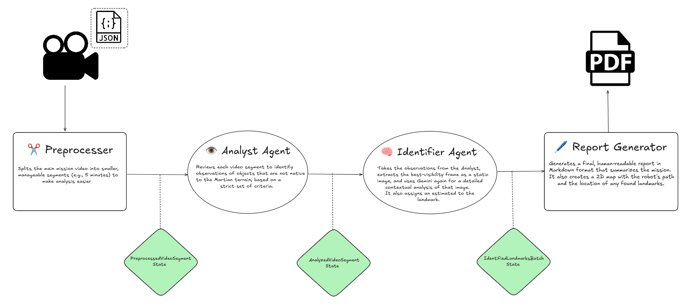
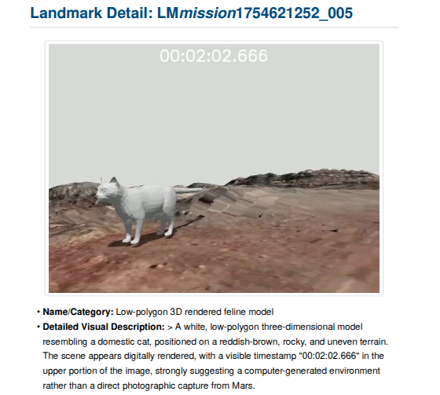
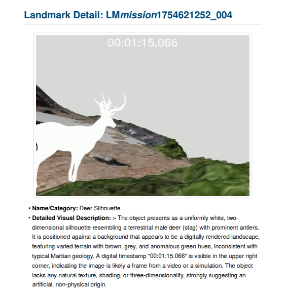
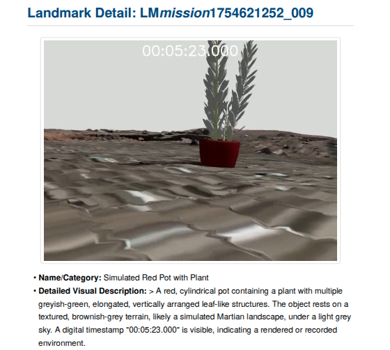
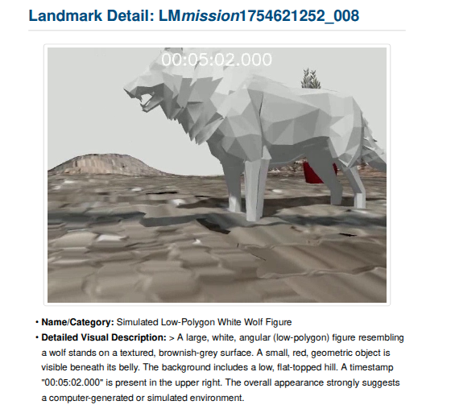

# ReportGenerator-Landmarks (Beta)
Report Generator for the Europe Rover Challenge 2025 \
by Terrab🌎ts



## How to run it?

1. Go to [Google AI Studio](https://aistudio.google.com)
2. Get you API Key and then save it in your environment as
```bash
export GOOGLE_API_KEY="you_api_key"
```
3. Execute the script from "src" directory
Without Trajectory
```bash
python run.py /home/user/.../erc_video.mp4 --mission_id test001
```

With Trajectory (Your extra information)
```bash
python run.py /home/user/.../erc_video.mp4 --pose_file path/to/poses.json --mission_id test002
```

## Result examples






## TODO
- Tool in the pipeline to eliminate redundant and repited objects (SOON!!!)
- Use a Depth Estimator model to estimate the position of the object

Of course you can solve these problems adding your extra information, images and descriptions to complete your report.
