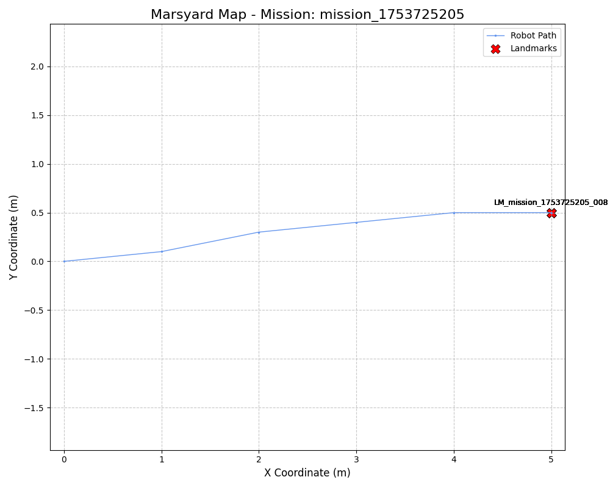
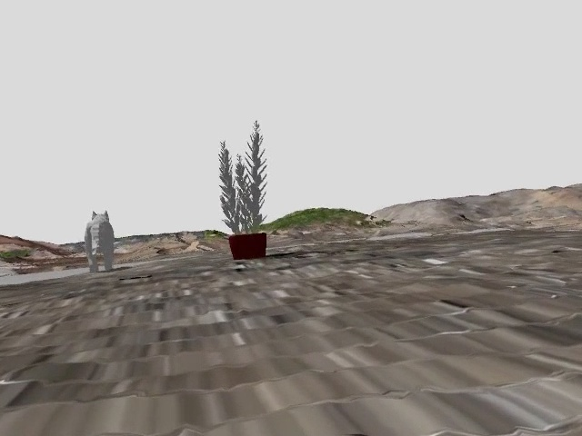

# ERC 2025 Mission Report: mission_1753725205

## General Findings

- **Total Landmarks Found:** 8
- **Mission Summary (LLM):** Mission summary by LLM (implementation with Gemini pending).

### Mission Map

---
---

## Landmark Detail: LM_mission_1753725205_008

- **Name/Category:** Anomalous Stylized Mammalian Figures (Feline/Canine and Cervine)
- **Detailed Visual Description:**
  Two distinct, stylized animal figures are observed against a simplified, monochromatic gray background and a low-detail landscape featuring earthen tones and patches of green. The figure on the left appears to be a gray, quadrupedal creature with pointed ears and a tail, resembling a feline or small canine. The figure on the right is a white, quadrupedal creature with prominent antlers, strongly resembling a deer or stag. Both figures exhibit a low-polygon or rendered aesthetic, suggesting they are not natural geological formations or typical mission hardware. The overall scene lacks the characteristic geological features and atmospheric conditions associated with Mars.
- **Martian Contextual Analysis:**
  - Probable origin: The visual characteristics of the figures (stylized, distinct animal forms, specific colors) and the surrounding environment (uniform gray sky, presence of green vegetation, lack of Martian geological detail) strongly indicate that these objects are not natural Martian formations or artifacts from any known Mars exploration mission. They appear to be elements of a computer-generated image, digital art, or a simulation, likely originating from Earth-based design or software.
  - Potential utility: Given their apparent non-Martian, digital origin, these objects hold no practical utility for current or future Mars rover missions or a potential base on Mars. They are not physical objects present on the Martian surface.
  - Relevance/Importance: This finding is of no scientific or operational relevance to Mars exploration, as the objects are demonstrably not located on Mars. Their presence in an image presented as "on Mars" suggests a misidentification or misattribution of the image source.
  - Dangers/Considerations: There are no physical dangers or special considerations associated with these digital representations. The primary consideration is to correctly identify the source and context of such images to prevent misinterpretation and ensure accurate reporting for Mars exploration efforts.
- **Estimated Location (Robot Pose):**
    - Timestamp: 5000 ms
    - X: 5.00 m, Y: 0.50 m
    - Orientation: 20.0°

---

## Landmark Detail: LM_mission_1753725205_008

- **Name/Category:** Anomalous Digital Renderings of Terrestrial Fauna
- **Detailed Visual Description:**
  The image displays two distinct, low-polygon, monochromatic figures superimposed onto a textured, undulating terrain. On the left, a grey, quadrupedal creature resembling a domestic cat or small feline is depicted in profile, casting a dark shadow. On the right, partially visible, is a white, quadrupedal creature with prominent antlers, strongly resembling a deer. The terrain itself has a reddish-brown hue, but exhibits unusual repetitive textures and sharp edges indicative of digital rendering artifacts. A faint, distant line of dark shapes in the background could represent distant terrain or artificial structures. The sky is uniformly light grey.
- **Martian Contextual Analysis:**
  - Probable origin: These objects are highly anomalous and definitively not natural to Mars. Their appearance (low-polygon count, monochromatic, distinct rendering style, terrestrial animal forms) strongly suggests they are digital artifacts or simulations. They do not resemble any known Martian geological formations, biological life, or spacecraft debris. It is highly probable that this image is a simulated or digitally generated scene, possibly from a training simulation, a conceptual render, or an erroneous data transmission, rather than a direct photograph from a Mars rover. The presence of terrestrial animals is biologically impossible for Mars.
  - Potential utility: If this image were a genuine transmission, the presence of such anomalies would be of immense scientific interest, potentially indicating unprecedented discoveries of Martian life or highly advanced alien technology. However, given the strong evidence for digital rendering, its utility for actual Mars exploration is zero. It might be useful for identifying errors in image processing pipelines or data handling if it originated from a mission system. As a conceptual render, it might serve illustrative purposes for hypothetical scenarios, but not for real-world mission planning.
  - Relevance/Importance: From a genuine Mars exploration standpoint, this finding is of paramount importance as an indicator of a critical anomaly in data acquisition or transmission. It would necessitate an immediate investigation into the source of the image to determine if it's a system malfunction, a deliberate simulation, or an external interference. If taken literally, it would represent the most significant biological discovery in human history, but this is overwhelmingly contradicted by the visual evidence. Its true relevance lies in identifying potential data integrity issues.
  - Dangers/Considerations: The primary danger is misinterpretation and the potential for diverting resources based on erroneous data. If this image were genuinely believed to be from Mars, it could lead to false conclusions, public alarm, or misallocation of scientific efforts. It highlights the critical need for robust data validation and authentication protocols in space missions. There are no physical dangers associated with the "objects" themselves as they are not real.
- **Estimated Location (Robot Pose):**
    - Timestamp: 5000 ms
    - X: 5.00 m, Y: 0.50 m
    - Orientation: 20.0°

---

## Landmark Detail: LM_mission_1753725205_008

- **Name/Category:** Image Anomaly - Non-Martian Digital Rendering
- **Detailed Visual Description:**
  The image depicts a computer-generated landscape featuring a prominent white silhouette of a cervid (deer-like animal) with antlers, positioned on a textured, reddish-brown foreground resembling uneven terrain. Patches of green, suggestive of vegetation, are visible on elevated areas in the mid-ground. In the distant background on the left, some blocky, dark structures are present, possibly representing artificial constructions. The overall visual quality and the presence of an Earth-like animal silhouette strongly indicate a digital rendering, not an authentic photographic capture from a planetary surface.
- **Martian Contextual Analysis:**
  - Probable origin: This image is unequivocally a computer-generated rendering or digital artwork, not an authentic photograph captured on the Martian surface. The white cervid silhouette is entirely inconsistent with any known Martian biology or geological formations. It is neither a natural Martian feature nor an artifact from any previous or current Mars mission.
  - Potential utility: As a non-authentic image, it holds no direct utility for current or future Mars missions in terms of physical interaction or scientific data acquisition. Its only potential utility could be as a test case for image authentication algorithms or for training artificial intelligence to distinguish genuine planetary imagery from artificial constructs.
  - Relevance/Importance: This "finding" is not relevant to actual Mars exploration as it does not represent a real object or phenomenon on the Martian surface. Its significance lies solely in emphasizing the critical need for rigorous image verification and source authentication protocols in planetary science to prevent misinterpretation of artificial data.
  - Dangers/Considerations: There are no physical dangers associated with this image. The primary consideration is the risk of misidentification or the propagation of misinformation if such a digitally created image were erroneously presented as genuine Martian data. It underscores the paramount importance of data integrity and authentication in all scientific reporting.
- **Estimated Location (Robot Pose):**
    - Timestamp: 5000 ms
    - X: 5.00 m, Y: 0.50 m
    - Orientation: 20.0°

---

## Landmark Detail: LM_mission_1753725205_008

- **Name/Category:** Anomalous Avian-shaped Object
- **Detailed Visual Description:**
  A small, dark, irregularly shaped object resting on the ground, partially obscured by a larger shadow, and casting its own distinct shadow. Its morphology strikingly resembles that of a terrestrial passerine bird, exhibiting features consistent with a head, beak, body, and tail. The object appears to be composed of dark, possibly rock-like, material.
- **Martian Contextual Analysis:**
  - Probable origin: Given the current scientific understanding of Mars, the presence of a living avian organism is considered impossible. Therefore, this object is most likely either a unique instance of pareidolia, where a natural geological formation coincidentally resembles a bird, or it is an artifact of image processing or a component of a synthetic image used for testing purposes. The surrounding green landscape strongly suggests a non-Martian origin for the image itself.
  - Potential utility: If a natural geological formation, it could offer insights into unusual weathering patterns or mineral compositions. If it is an artificial component of a test image, its utility lies in evaluating the performance of anomaly detection algorithms and image analysis software for future missions.
  - Relevance/Importance: The finding is highly significant if it were genuinely a biological entity, representing a revolutionary discovery of extraterrestrial life. However, given the high improbability, its primary importance likely lies in either its geological uniqueness (if natural) or its role in validating image analysis tools and procedures (if synthetic).
  - Dangers/Considerations: If hypothetically a biological entity, extreme caution regarding biological contamination (forward and backward) would be paramount. If a geological feature, no immediate dangers are apparent. If the image is synthetic, the main consideration is to ensure clear distinction between real mission data and simulated content in future reports to maintain data integrity and prevent misinterpretation.
- **Estimated Location (Robot Pose):**
    - Timestamp: 5000 ms
    - X: 5.00 m, Y: 0.50 m
    - Orientation: 20.0°

---

## Landmark Detail: LM_mission_1753725205_008

- **Name/Category:** Terrestrial Animal Silhouette (Deer/Stag)
- **Detailed Visual Description:**
  A flat, featureless white silhouette of a large ungulate, specifically a deer or stag with prominent antlers, positioned in the foreground of a digitally rendered landscape. The background features brown, rocky terrain with some green patches, under a uniform grey sky. The object itself shows no three-dimensional form or surface texture, appearing as a pure white cutout.
- **Martian Contextual Analysis:**
  - Probable origin: This object is not natural to Mars and is not a physical artifact from any known Mars mission. Its appearance as a stark, untextured silhouette strongly suggests it is an artificial overlay, a rendering artifact from a simulation, a placeholder graphic, or a result of data corruption or an image processing error. It is highly improbable to be a real object captured on the Martian surface.
  - Potential utility: No direct utility for scientific or engineering aspects of Mars missions. Its presence in a purported mission image would primarily serve to highlight potential issues in image acquisition, transmission, or processing pipelines, requiring investigation into data integrity or software anomalies.
  - Relevance/Importance: Extremely low as a physical discovery on Mars. Its significance lies solely in being an anomalous image artifact. If encountered in actual mission data, it would be critically important to understand its origin to ensure data reliability and prevent misinterpretation. It underscores the necessity for rigorous data validation protocols.
  - Dangers/Considerations: No physical dangers. The primary consideration is the integrity of mission data. Such an anomaly, if presented as genuine, could lead to erroneous conclusions or divert resources if its artificial nature is not immediately recognized and investigated as a data anomaly.
- **Estimated Location (Robot Pose):**
    - Timestamp: 5000 ms
    - X: 5.00 m, Y: 0.50 m
    - Orientation: 20.0°

---

## Landmark Detail: LM_mission_1753725205_008

- **Name/Category:** Polygonal Feline-like Figure
- **Detailed Visual Description:**
  A light-colored, semi-transparent, polygonal figure resembling a cat or small feline, positioned as if walking uphill on a steep, reddish, rocky terrain. Its body shows distinct facets, characteristic of a low-polygon 3D model. The background is a uniform light grey.
- **Martian Contextual Analysis:**
  - Probable origin: This object is highly unlikely to be natural to Mars or a physical component from any known mission. Its appearance strongly suggests it is a digital artifact, likely a rendering anomaly or an accidental inclusion from a simulation/visualization tool during image processing or data handling.
  - Potential utility: As a digital artifact, it holds no physical utility for the current rover mission or future operations. Its primary utility lies in identifying and rectifying any underlying software, hardware, or data processing issues that led to its appearance in the image.
  - Relevance/Importance: This finding is not relevant to Martian geology or biology, as it does not represent a natural feature or life form. Its significance pertains to data integrity; understanding its origin is crucial to ensure the reliability and accuracy of all imagery and scientific data collected by the mission.
  - Dangers/Considerations: There are no physical dangers associated with this non-physical object. The main consideration is the potential for compromised data integrity if the source of this anomaly is not identified and corrected. Additionally, public release without clear explanation could lead to widespread misinformation and misinterpretation regarding discoveries on Mars.
- **Estimated Location (Robot Pose):**
    - Timestamp: 5000 ms
    - X: 5.00 m, Y: 0.50 m
    - Orientation: 20.0°

---

## Landmark Detail: LM_mission_1753725205_008

- **Name/Category:** Potted Plant (Simulated/Conceptual)
- **Detailed Visual Description:**
  A dark red, cylindrical pot containing three grey, spiky, upright plant-like structures. The pot is situated on a small, distinct green mound. The surrounding environment consists of a low-resolution, textured, brownish-grey foreground transitioning to distant hills under a light grey sky. The visual characteristics strongly suggest a computer-generated image or simulation rather than a photographic capture from a real Martian surface.
- **Martian Contextual Analysis:**
  [
  - Probable origin: This object is not natural to Mars and does not correspond to any known hardware deployed by past or current Mars missions. Its appearance, particularly the presence of a green mound and the overall rendering quality, indicates it is a simulated or conceptual image. It likely originates from a 3D rendering environment, potentially for visualization of future Martian habitats, terraforming concepts, or as a placeholder asset in a digital simulation.
  - Potential utility: As a physical object, a plant of this nature would be critical for future human self-sufficiency on Mars, providing oxygen, food, and psychological benefits. As a simulated object, its utility lies in its conceptual representation: it serves as a visual aid for planning future Martian bases, demonstrating potential biological life support systems, or for public outreach and educational materials regarding long-term human presence on Mars. It holds no direct utility for current robotic rover operations.
  - Relevance/Importance: If this were a genuine discovery, it would be of unparalleled significance, indicating either extant Martian life or successful, advanced human-induced terraforming. However, given its simulated nature, its importance is conceptual, highlighting the aspirational goals of human exploration and settlement on Mars, particularly the challenges and possibilities of creating sustainable biospheres in an extraterrestrial environment.
  - Dangers/Considerations: As a simulated image, there are no physical dangers. The primary consideration is to ensure its correct classification as a conceptual or rendered asset to prevent misinterpretation as an actual finding from a Mars mission. If, hypothetically, such an object were genuinely encountered, it would necessitate immediate, extensive scientific investigation and strict adherence to planetary protection protocols.
  ]
- **Estimated Location (Robot Pose):**
    - Timestamp: 5000 ms
    - X: 5.00 m, Y: 0.50 m
    - Orientation: 20.0°

---

## Landmark Detail: LM_mission_1753725205_008

- **Name/Category:** Simulated Terrestrial Biological Models in a Martian Environment
- **Detailed Visual Description:**
  The image displays two distinct computer-generated models within a rendered Martian-like landscape. On the left is a low-polygon, gray quadrupedal figure resembling a wolf or dog, viewed from behind. To its right, a dark red pot contains several gray, spiky, plant-like structures. The background features barren hills under a light gray sky, with a textured, simplified ground plane in the foreground.
- **Martian Contextual Analysis:**
  - Probable origin: These objects are highly unlikely to be physical discoveries on Mars. Their appearance (low-polygon, simplified textures, generic rendering style) strongly indicates they are computer-generated models. They likely originate from a 3D rendering, simulation, or game engine, representing simulated terrestrial flora and fauna placed within a simulated Martian environment.
  - Potential utility: While not physically useful for a real mission, these simulated models could serve various purposes in a virtual context. The "wolf" model might be used for testing autonomous navigation algorithms (e.g., obstacle detection, tracking moving targets) or as a placeholder for future biological entities in training simulations for crewed missions. The "potted plant" could be used for developing visual recognition systems for biological samples, testing environmental monitoring, or visualizing concepts for future Martian agriculture and habitats. The overall scene could be a testbed for rendering fidelity or virtual reality applications for mission planning and public engagement.
  - Relevance/Importance: From a real mission standpoint, the presence of such objects would be an unprecedented and revolutionary discovery, but this is highly improbable. Instead, the image's relevance lies in the domain of Mars mission simulation and visualization. It underscores the critical need for robust data authentication in real missions. It could also be important for conceptualizing and communicating future, more advanced Mars exploration scenarios involving human presence and potential bio-regeneration.
  - Dangers/Considerations: As simulated elements, they pose no physical danger on Mars. The primary consideration is to correctly identify them as artificial data to prevent misinterpretation and false scientific conclusions. If presented as genuine findings, they could lead to significant misallocation of resources and public misinformation. Within a simulation, considerations would include the accuracy and fidelity of the models for their intended purpose.
- **Estimated Location (Robot Pose):**
    - Timestamp: 5000 ms
    - X: 5.00 m, Y: 0.50 m
    - Orientation: 20.0°

---

